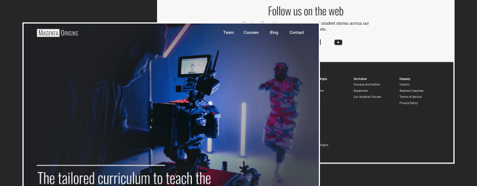

# Filmmaking Curriculum

A concept landing page for a brand that provides a filmmaking curriculum for high school students. The page was designed in Figma with a modern look in mind, emphasizing the skills provided by the curriculum and providing multiple ways to contact the brand. It was then developed via HTML, CSS, and JavaScript with a focus on accessibility and user interaction. The code repository was uploaded to GitHub and deployed to GitHub Pages to provide a live demonstration.

## Links

